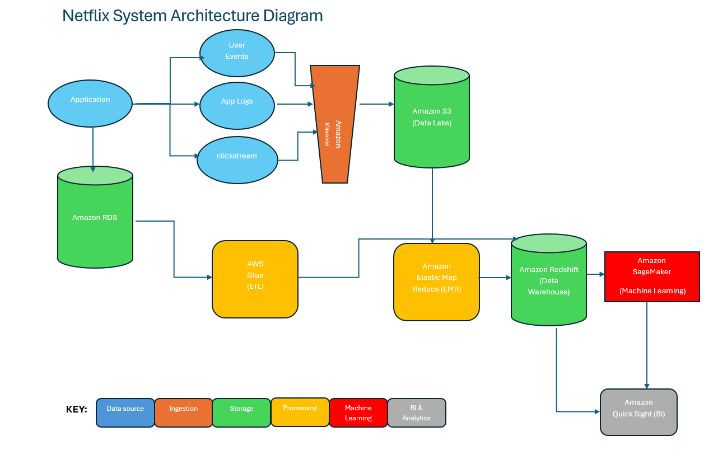

## Introduction
Netflix is one of the leading digital streaming platforms in the world with millions of subscribers across many countries. Unlike traditional media companies, Netflix relies heavily on data to operate its platform. Every action on Netflix such as searching for a movie, clicking on a title, pausing a video or watching a show, generates a large amount of user data. This data helps Netflix understand viewer behavior and preferences more accurately. It is also widely known that Netflix operates its streaming infrastructure using cloud services from Amazon Web Services (AWS) which enables the platform to process and manage large volumes of data efficiently.

Big data analytics plays an important role in Netflix’s business strategy. By analyzing viewing history and content information, Netflix can identify popular trends and predict what audiences may want to watch. These insights allow Netflix to provide personalized recommendations and improve the overall user experience. Big data also supports marketing and content decisions. Netflix uses data to promote relevant content to users and recommend movies or shows that match their interests. In addition, data analysis helps Netflix decide which original content to produce, reducing the risks associated with content investment and improving customer retention.

The purpose of this report is to examine how Netflix uses big data technologies and analytics to support its recommendation system and business operations. The report discusses the types of data generated by Netflix, the design of its big data system architecture and the challenges related to the five characteristics of big data which are Volume, Velocity, Variety, Veracity and Value. It also explores machine learning techniques used in recommendation systems and explains how scalability, fault tolerance and data security can be maintained in a large-scale streaming platform.

The report is divided into five sections. Section 1 covers the types of data generated by Netflix and their role in personalization. Section 2 outlines the high-level architecture of the big data system. Section 3 addresses how Netflix manages the five characteristics of big data. Section 4 examines machine learning techniques in recommendation systems. Section 5 discusses strategies for scalability, fault tolerance and data security in large-scale streaming systems.

## Data Types and Support for Personalization
Netflix generates a massive volume of data that can be categorized by both structured and unstructured data types

## Structured Data
Structured data is organized and the format is usually defined before the data is stored. Below are some examples of the structured data that Netflix stores and how it aids personalization.
Explicit Feedback Ratings: Users can rate titles
Support for Personalization: Netflix uses a Recommendation System. There are two types of recommendation systems: collaborative filtering models and content-based filtering (AlgoDaily, 2026).

Collaborative Filtering: Recommendations of other members with similar tastes and preferences on the service (Netflix, n.d.). If user A likes “Breaking Bad” and user B likes “Breaking Bad” and “Gotham”, then “Gotham” is recommended to user A.

Content- Based Filtering: Recommendations of how you rated a title (Netflix, n.d.). The algorithm would find other similar titles based on the title rating you provided.

Viewing Metrics: Analyzing the user’s viewing history (Netflix, n.d.). Netflix is able to capture how long the user spent on a show, if the user completed the show, or if the user abandoned the show entirely.
Support for Personalization: If the user does not complete watching a show, the system learns to rank it lower for similar profiles as the user

## Unstructured Data

Unstructured data in not stored in any predefined format. Below are some examples of the unstructured data that Netflix stores and how it aids personalization.
Search Queries: The raw text typed in search bar
Support for Personalization: Natural Language Processing (NLP) analyzes the text and understand user’s intent and interests even when the specific title isn’t available and allows the system to suggest related alternatives
Visual Content (Thumbnails): Netflix stores millions of thumbnails and frames and customizes the thumbnail for every user. 
Support for Personalization Netflix uses Contextual Bandits (a machine learning algorithm) to match artwork to your specific taste. If a user frequently watches romances, the system might show a thumbnail of a show’s lead couple. If they prefer action, it might show an explosion from the same show. (Chandrashekar et al. (2017))

## Netflix System Architecture Diagram

## Architectural Design Decisions
Amazon Kinesis (Ingestion Layer): Used for high-speed streaming (Amazon Web Services, n.d.). Captures the data from various sources: logs, clickstreams, user events 

Amazon RDS (OLTP Storage Layer): Amazon RDS is a managed service designed to simplify the setup and scaling of relational databases in the cloud, helping Netflix optimize their total cost of ownership (Amazon Web Services, n.d.). 

## Amazon S3 (Data Lake- Primary Storage Layer):
This is where everything arrives first. Amazon S3 The central repository or Data Lake that stores massive volumes of raw logs and video assets (Amazon Web Services, n.d.).

## Amazon Elastic Map Reduce (Processing Layer):
Used to run data processing and transformation (Amazon Web Services, n.d.). The EMR transforms the data (from Amazon S3) and sends it to Amazon Redshift.

## AWS Glue:

ETL process to transform the Netflix data (e.g. calculating monthly totals) and sends it over to the data warehouse (Amazon Redshift).

## Amazon Redshift (OLAP Storage Layer): 
The Data Warehouse is where structured data is stored for complex SQL Analytics and Business Intelligence. This would be ideal for calculating Netflix style metrics “What is the average watch time per genre”. Amazon Redshift will be used as their OLAP. Amazon Sage Maker will run off of Redshift.

## Amazon SageMaker (Machine Learning):

A service that allows data scientists and developers to quickly build, train, and deploy machine learning (ML) models at any scale (Amazon Web Services, n.d.). Netflix will build specialized style algorithms such as a specialized recommendation engine and perhaps even a user churn predictor. Sage maker is also better suited for heavy data work that data scientists require. Ideally, we will build models in Sage Maker and use Amazon Quick Sight for visualization.

## Amazon Quick Sight (BI & Analytics): 

This will be used for our Business Intelligence (Amazon Web Services, n.d.). Here we will create interactive dashboards and visualizations that enable stakeholders to explore data and gain actionable insights.

## Addressing the Challenges of the 5Vs 
There are five fundamental characteristics of Big Data: Volume, Velocity, Variety, Veracity, and Value. As a global streaming platform, Netflix processes massive amounts of data generated by user interactions. Managing these characteristics effectively allows the company to maintain efficient data processing and deliver a personalized and high-quality viewing experience to its users.
Volume

Netflix processes extremely large amounts of data on a daily basis. Every interaction in the platform represents new information that must be stored and analyzed. Every user will be performing continuous activity, representing thousands of terabytes. Amazon S3 is a cloud based storage solution that can act as a platform capable of storing these massive amounts of raw data. Its architecture serves as a data lake that will allow Netflix to store structured, semi-structured and non-structured data. Data can then be accessed using other Amazon features, like Amazon Athena, which is capable of running standard SQL queries for structured and semi-structured data. 

## Velocity
Refers to the speed at which data will be generated and processed. Amazon offers Amazon Kinesis, a tool whose infrastructure, scaling and maintenance is completely handled by AWS, and that is capable of enabling real-time data ingestion that captures information from user devices, and allows Netflix to generate accurate and updated recommendations. It can be integrated with other AWS tools such as S3 for long term storage, and it can scale from megabytes to terabytes of data to accommodate high user traffic. 

## Variety 
Netflix’s platform generates structured, semi-structured and unstructured data. Structured data includes the user id, subscription details, session information and ratings. Unstructured data includes activity logs, search queries, and clickstreams generated from user interactions. Managing these different types of data requires flexible storage and processing tools. Netflix can address this challenge by using Amazon S3 as a centralized storage lake, and AWS Glue and EMR for processing and transforming the data for analytics and machine learning. 

## Veracity
Veracity refers to the reliability and accuracy of the data used for analysis. In big platforms like Netflix, there may be occasions where data has inconsistencies/noise caused by user interruptions and network issues. To ensure data integrity, Netflix can implement ETL pipelines with services like AWS Glue to clean, validate, and transform datasets to be loaded and be ready for accurate analysis. 

## Value
The ultimate goal of keeping large amounts of raw data, is to generate meaningful insights that guide the company towards making good decisions and improve user experience. Netflix can accomplish this by using some of the tools from the proposed architecture. 

Amazon Redshift can be used by analysts to perform SQL queries to analyze metrics such as watch times, popular movies and shows, churn rates, and more. 

Amazon Sagemaker can help develop machine learning models to identify viewer preferences and generate recommendations. 
Finally, visualization tools such as Amazon Quicksight can capture these insights into dashboards and reports, allowing decision- makers to better understand user behaviour and make decisions. 

## Machine Learning Technique 

One thing that allows Netflix to keep users engaged is the ability to provide recommendations based on historical data. Machine learning plays a fundamental role, it uses algorithms to identify patterns and make predictions on what will generate the biggest interest. Users can then feel more comfortable, and spend more time using the platform. 

There are several machine learning techniques Netflix can use for making predictions, one of the most common is collaborative filtering. IBM defines it as “retrieval method that recommends items to users based on how other users with similar preferences and behaviour have interacted with that item.” (IBM, n.d.). For example, if a group of users are watching a specific show, the platform will recommend this show to other users that share similar interests. This allows Netflix to transform collective interests into personalized recommendations. 

A second technique is content-based filtering, which focuses on characteristics of the object that is being watched, like genre, actors, titles, countries, etc. For example, if a user is interested in science fiction movies, the platform will recommend movies from the same genre. This is especially useful for occasions when there is limited user interaction. 
Netflix also uses a technique called “contextual bandits” which is an advanced learning technique based on exploration and exploitation. The platform can explore new recommendations and exploit content that is known to perform well. One example is the use of different thumbnails for the same movies or series. The algorithm identifies which ones generate the biggest interest, and over time learns which ones to use for each user profile. 

These machine learning techniques operate within Netflix’ architecture. Information is collected through data ingestion systems like Amazon Kinesis, and stored inside the data lakes, it will then be processed using tools like Amazon EMR and used for model training. In this case, Amazon SageMaker will allow the system to build, train and deploy recommendation models based on all the users interactions. SageMaker  supports continuous model monitoring and retraining, which will allow Netflix to have updated recommendations, improve content discovery and maintain customer engagement. 

## Contributors:
Afeena Gafoor: 
Swe
Daniel Perez
Sai 

