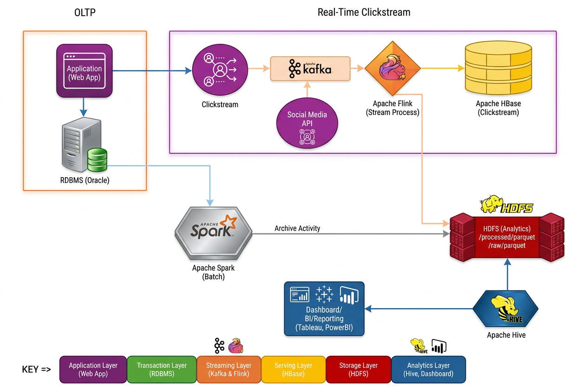

# E-Commerce Real-Time Recommendation Pipeline Architecture

## Overview

This architecture represents a scalable big data pipeline designed to support **real-time recommendation systems for an e-commerce platform**. The pipeline processes user interaction events such as product views, clicks, and purchases to generate personalized product recommendations.

The architecture combines **stream processing and batch processing** to support both real-time insights and historical analytics.

# Data Pipeline Architecture

# Design Decisions
The proposed architecture separates transactional processing, real-time analytics, and data warehousing into distinct layers.
The web application interacts directly with an RDBMS, which functions as the OLTP system. This database manages transactional operations such as orders, inventory updates, and product information. The RDBMS ensures ACID compliance and supports day-to-day operational workflows.
Simultaneously, user interactions generate clickstream data, which is captured and published to Apache Kafka. Kafka acts as the streaming ingestion layer, enabling fault-tolerant event collection. We did not choose flume in the event Flink stops working flume does not have the capacity to hold the data. Social media feedback is also ingested as an additional event stream through Kafka and processed in real time using Flink.
For real-time analytics, clickstream events are processed using Apache Flink. Flink performs event-time processing and computes behavioral insights such as related product recommendations. The computed recommendations are written to a serving database- Apache HBase, which provides low-latency key-based lookups. The web application queries this serving layer to instantly return similar items (e.g., other red shoes) when a user performs a search. This design avoids sending recommendation results back to the RDBMS, thereby preventing transactional bottlenecks.
For historical analytics and reporting, both transactional data from the RDBMS and processed clickstream data are stored in Apache Hadoop HDFS in Parquet format. Batch ETL from the RDBMS is performed using Apache Spark, ensuring efficient large-scale transformations.
The analytical layer is implemented using Apache Hive, which provides SQL-based querying over the Parquet datasets stored in HDFS. Business intelligence tools connect to Hive to generate dashboards, reports, and long-term trend analysis.
By separating the architecture into:
•	OLTP (RDBMS),
•	Real-time streaming (Kafka + Flink),
•	Serving layer (HBase),
•	Data warehouse storage (HDFS),
•	Analytics layer (Hive),
the system ensures low-latency recommendations for users while also supporting scalable historical analytics and reporting.

# Architecture Components

## 1. Data Sources

Data is generated from multiple systems within the e-commerce platform.

Examples include:

- User browsing activity
- Product views
- Add-to-cart events
- Purchase transactions
- Application logs

These events are typically produced by:

- Web applications
- Mobile applications
- Backend services

---

## 2. Data Ingestion Layer

User activity events are streamed into the platform using **Apache Kafka**.

Kafka acts as a distributed messaging system that enables:

- High-throughput event ingestion
- Real-time data streaming
- Decoupling between producers and consumers

Each event is published to Kafka topics such as:

- `user-click-events`
- `product-view-events`
- `purchase-events`

---

## 3. Stream Processing Layer

**Apache Flink** processes streaming data in real time.

Responsibilities include:

- Event filtering
- Data enrichment
- Sessionization
- Real-time feature generation

Flink can detect patterns such as:

- frequently viewed products
- user browsing behavior
- trending items

This enables the system to generate near real-time recommendations.

---

## 4. Storage Layer

The architecture uses multiple storage systems optimized for different workloads.

### Hadoop HDFS

Stores raw event data for large-scale distributed storage.

### Hive

Used for:

- Data warehousing
- Batch queries
- Historical analytics

Hive tables store structured data derived from raw event logs.

### HBase

Provides **low-latency access to user profile and recommendation data**.

HBase is used for:

- storing user recommendation results
- fast lookup for real-time applications

---

## 5. Batch Processing Layer

**Apache Spark** performs large-scale batch processing on historical data.

Typical workloads include:

- user behaviour analysis
- product affinity analysis
- feature engineering
- training recommendation models

Spark jobs read data from **Hive tables stored in HDFS**.

---

## 6. Machine Learning Layer

Machine learning models analyze user behavior to generate recommendations.

Possible models include:

- collaborative filtering
- item similarity models
- matrix factorization
- ranking models

Model outputs are stored in **HBase** for real-time retrieval by the application.

---

## 7. Application Integration

The recommendation service retrieves recommendations from HBase and delivers them to:

- the web storefront
- mobile applications
- personalized marketing systems

This enables real-time personalized product suggestions.

---

# Key Benefits of the Architecture

This architecture provides several advantages:

- Scalable distributed data processing
- Real-time event streaming
- Low-latency recommendation retrieval
- Historical analytics for model training
- Fault-tolerant big data infrastructure

---

# Potential Improvements

Future enhancements could include:

- deploying recommendation APIs
- integrating Spark ML pipelines
- implementing feature stores
- adding monitoring using tools such as Prometheus or Grafana

